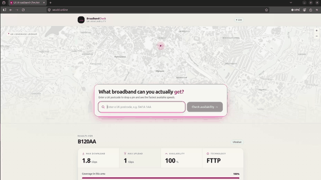

<h1 align="center">UK Broadband Checker — Serverless on AWS</h1>

<p align="center">
  <strong>UK postcode broadband checker</strong> — a static website and API on AWS,<br/>
  managed with Terraform and released through GitHub Actions.<br/>
  <em>Enter a postcode, see the available speeds, and find it on the map.</em>
</p>

\---

## Architecture

<p align="center">
  
</p>

The main AWS resources are in London (eu-west-2). CloudFront, WAF and the TLS certificate use us-east-1, as required by AWS. Terraform creates the website, API, cache, security controls and monitoring.

\---

## Why this project

The project runs a small web app safely in the cloud:

* Terraform describes the AWS infrastructure
* GitHub Actions deploys it without storing AWS access keys using OIDC
* CloudFront and WAF protect the public site
* Two caches reduce repeated requests to Ofcom
* Deployments check the health endpoint before they finish

> Based on \\\[Ofcom’s public coverage checker](https://checker.ofcom.org.uk/en-gb/broadband-coverage).

<p align="center">
  
  <br/>
  <em>Live lookup on <a href="https://seudd.online">seudd.online</a> — <a href="docs/assets/webapp.webm">full recording</a></em>
</p>

\---

## How a lookup works

1. A user types a postcode. The browser checks it against [postcodes.io](https://postcodes.io) and drops a pin on the map.
2. The app calls `/api/check?pc=…` behind CloudFront.
3. **Edge cache (5 minutes)** — the same postcode looked up again is answered at the edge, with no backend work at all.
4. **Database cache (24 hours)** — on an edge miss, Lambda reads DynamoDB and typically answers and writes very fast.
5. **Live fetch** — only on a database miss does Lambda call Ofcom, return the result, and write it back for next time.

The response records whether it came from the cache or from Ofcom's api.

\---

## Infrastructure highlights

### Edge security

* HTTPS through a custom domain and ACM certificate
* Private S3 bucket, accessed through CloudFront only
* WAF rules to block common attacks and excessive requests
* Security headers such as HSTS, CSP and clickjacking protection

### Origin design

* A Node.js Lambda function handles postcode lookups
* DynamoDB keeps results for 24 hours
* The Ofcom key is kept in AWS (SSM) and is never sent to the browser
* CloudWatch logs store only a short hash of each postcode to keep users PII data private.

### Delivery \& caching

* Website files with content-hashed names are cached for one year
* index.html is always fresh, so releases do not need a cache clear
* Frontend and backend deploy separately through GitHub Actions

### Observability \& cost

* One CloudWatch dashboard shows the main services and cache behaviour
* Email alerts cover errors, slow requests and throttling
* A **$20** monthly budget watches forecasted spend

\---

## Scalability

The app can handle more visitors without adding or resizing servers.

* **CloudFront** serves the website and repeated lookups close to the visitor.
* **Lambda** runs only when a request reaches the API.
* **DynamoDB** grows with the number of cached postcodes.
* **API Gateway** and S3 are managed AWS services, so there is no server capacity to plan.

The two cache layers are:

* CloudFront keeps successful lookups for **5 minutes**.
* DynamoDB keeps them for **24 hours**.

Ofcom traffic grows with the number of different postcodes checked each day, not with the number of page visits. Ten thousand people checking the same popular areas would still create relatively few Ofcom requests.

If the project grew further, the next steps would be a second AWS region for failover, a higher WAF limit for shared networks, and scheduled caching for the busiest postcodes. The current design suits a UK-focused application and keeps costs low as traffic grows.

\---

## CI/CD — six workflows without AWS access keys

GitHub Actions uses short-lived AWS permissions through OIDC. AWS access keys are not stored in the repository.

|Workflow|When it runs|What it does|
|-|-|-|
|`ci.yml`|Every push and pull request|Checks the code, runs tests, builds the demo, and runs Snyk, Checkov and Terraform formatting checks|
|`terraform-plan.yml`|Pull requests changing Terraform|Creates a read-only Terraform plan for review|
|`terraform-apply.yml`|Manual approval|Applies the infrastructure and checks `/api/health`|
|`deploy-frontend.yml`|Frontend changes on `main`|Builds and uploads the website|
|`deploy-backend.yml`|Lambda changes on `main`|Updates the API and checks its health|
|`terraform-destroy.yml`|Manual approval|Removes the running AWS resources while keeping Terraform state|

GitHub Environments: **`production`** (apply and deploys) and **`production-destroy`** (teardown only).

### Pipeline Documentation

<p align="center"><strong>CI, frontend deployment and Lambda deployment passing on <code>main</code></strong></p>
<p align="center">
  
</p>

<p align="center"><strong>Terraform Destroy — typed confirmation plus environment approval</strong></p>
<p align="center">
  
</p>

### Releases

Frontend assets have hashed filenames and can be cached for a year. `index.html` is kept fresh, so a new release appears without waiting for a CloudFront cache clear.

### Deployment safeguards

* Production changes need a typed confirmation (`apply-prod` or `destroy-prod`)
* GitHub Environment approval is required before production actions run
* Deployments first check that the AWS resources exist
* Terraform state and its lock table are protected from deletion

\---

## Security Measures

|Protection|How it works|
|-|-|
|Private website|S3 is not public; CloudFront is the only way to read the site|
|Protected API|Requests must come through CloudFront and include a private verification value|
|Deployment permissions|GitHub uses temporary permissions through OIDC, not stored AWS keys|
|Secret handling|The Ofcom key stays in AWS and is read only by Lambda|
|Log privacy|Postcodes are never written to CloudWatch; only a short hash is used|
|Browser security|HTTPS, WAF and security headers protect visitors and the site|

\---

## Observability

CloudWatch dashboard **`broadband-checker`** (`eu-west-2`) gives one view of the website, API, cache and alarms. Email alerts report problems, and a **$20** AWS Budget watches forecasted spend.

|Area|What it shows|
|-|-|
|Website and WAF|Traffic, errors and blocked requests|
|API and Lambda|Requests, failures, speed and throttling|
|Database cache|Cache use and any read or write problems|
|Alarms|Current status and recovery notifications|

The dashboard shows cached lookups alongside live Ofcom lookups.

<p align="center">
  <video src="docs/assets/cloudwatch-dashboard.webm" controls muted playsinline width="900">
    <a href="docs/assets/cloudwatch-dashboard.webm">Watch the dashboard walkthrough</a>
  </video>
  <br/>
  <em><a href="docs/assets/cloudwatch-dashboard.webm">Open the dashboard walkthrough</a></em>
</p>

\---

## Run locally (no AWS required)

Demo mode uses a local fixture file for coverage data, so the full interface runs without AWS costs. Postcode entry still validates against the live postcodes.io API, so autocomplete and the map pin behave as they do in production.

**Requirements:** Node 20+ and npm 10+.

```bash
git clone https://github.com/sudd22/broadband-checker.git
cd broadband-checker/frontend
npm install
npm run dev          # http://localhost:5173, VITE\\\_API\\\_URL=/demo by default
```

|Postcode|Scenario|What you should see|
|-|-|-|
|`SW1A 1AA`|Gigabit FTTP, London|1000 / 220 Mbps, full availability|
|`EH1 1YZ`|Superfast FTTC, Edinburgh|80 / 20 Mbps|
|`LL57 4TH`|Legacy copper, rural Wales|11 / 1 Mbps|
|`PO30 1UD`|No coverage, Isle of Wight|0 / 0 Mbps and a “no infrastructure” alert|
|`BT71 7BA`|Simulated upstream failure|The error banner|
|anything else|Generic fallback|67 / 18 Mbps FTTC|

Input is normalised first, so `sw1a 1aa`, `Sw1a1Aa` and `SW1A 1AA` all resolve to the same entry. `VITE\\\_API\\\_URL` is the only switch: `/demo` for fixtures, `/api` for the live backend.

Backend tests are fully mocked — no AWS, no network:

```bash
cd ../lambda
npm install
npm test             # 100% coverage gate on the handler
```

\---

## Repository layout

```text
├── .github/workflows/          # CI, deploys, Terraform plan/apply/destroy
├── cloudfront-functions/       # CSP + security headers (viewer response)
├── frontend/                   # React + Vite + TS + Tailwind + MapLibre
│   └── public/data/            # Demo-mode fixture database
├── lambda/                     # Node 20 handler + Vitest (100% coverage)
├── terraform/                  # Root stack — wires the three modules below
│   ├── bootstrap/              # State bucket, lock table, OIDC provider, IAM roles
│   ├── origin/                 # eu-west-2 compute, storage and secrets
│   ├── edge/                   # us-east-1 CDN, WAF, DNS, TLS
│   └── observability/          # Alarms, dashboard, SNS, budget
└── docs/assets/                # Recordings and screenshots
```

\---

## Cost

Roughly **$10 a month** while the stack is up, plus about $12 a year for the domain.

|Service|Monthly|
|-|-|
|WAF (4 rules)|\~$9 — the dominant cost|
|API Gateway HTTP API|< $1|
|CloudFront (PriceClass\_100)|< $1 at low traffic|
|Route 53 hosted zone|\~$0.50|
|S3, DynamoDB, Lambda, tracing|\~$0.03 combined|
|ACM, SSM, CloudWatch, SNS|$0 — within free tiers|

A **$20** budget sends email alerts at 20%, 40% and 80% of forecast spend. After a teardown, the running cost is **$0**; only the domain renews.

\---

## Teardown

**Actions → Terraform Destroy → Run workflow**, type `destroy-prod`, then approve the `production-destroy` environment.

|Destroyed|Retained by design|
|-|-|
|CloudFront, WAF, ACM, Route 53 records|Terraform **state bucket** (`prevent\\\_destroy`)|
|S3 static + logs buckets|DynamoDB **state lock** table (`prevent\\\_destroy`)|
|API Gateway, Lambda, DynamoDB cache, SSM parameter|GitHub OIDC provider + both IAM roles|
|CloudWatch alarms, dashboard, SNS topics, budget|Repository, recordings, demo mode|

The bootstrap resources stay in place, so redeploying requires one workflow run. Demo mode does not depend on AWS.

\---

## Live verification

```bash
curl -s https://seudd.online/api/health
# {"status":"ok","ts":"..."}
```

|Check|Expected|
|-|-|
|Custom domain over HTTPS|App loads through ACM + CloudFront|
|Postcode lookup|Results plus a map pin|
|Repeat lookup|Noticeably faster — served from cache|
|GitHub Actions|CI, Plan, Apply, Deploy and Destroy all green|

\---

## Design decisions

|Choice|Why it was made|
|-|-|
|Two cache layers|Faster repeat searches and fewer calls to Ofcom|
|No postcode in logs|Postcodes can be personal data, so logs use a short hash|
|Fresh `index.html`|New website releases appear without waiting for a cache clear|
|Separate plan and deploy permissions|A pull request can review infrastructure without changing it|
|Demo mode|The website remains easy to test without AWS running|

\---

## Author

**Seud** — Cloud \& DevOps Engineer<br/>
GitHub: [@sudd22](https://github.com/sudd22) · Repository: [sudd22/broadband-checker](https://github.com/sudd22/broadband-checker)

Broadband data comes from Ofcom’s public coverage API.

<p align="center">
  <sub>Terraform, OIDC, edge security, caching and automated deployments.</sub>
</p>

