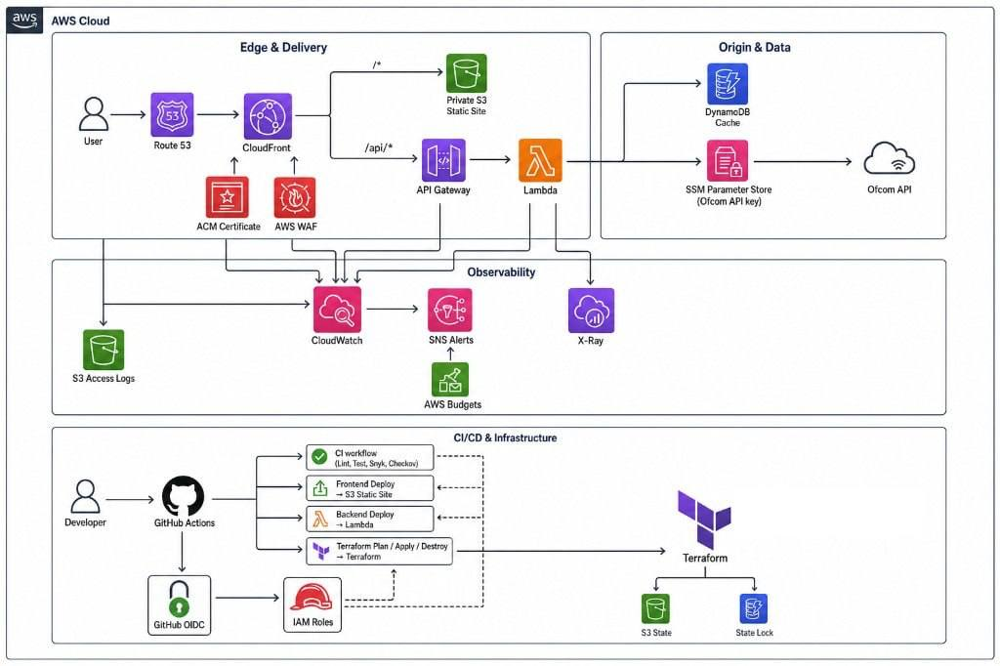
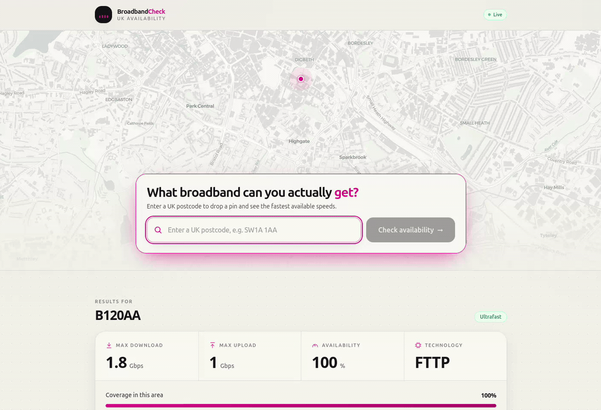
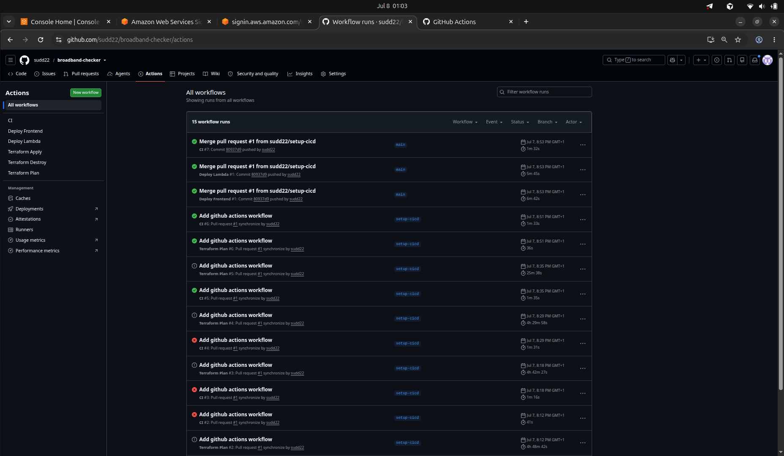
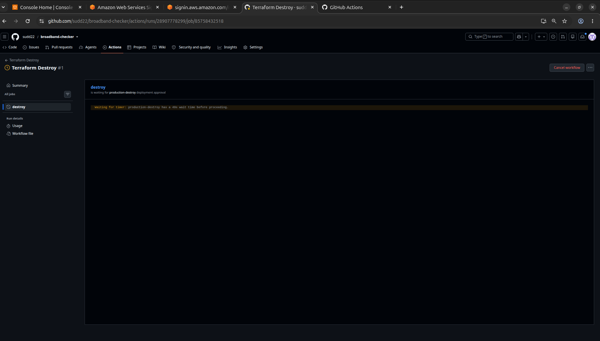
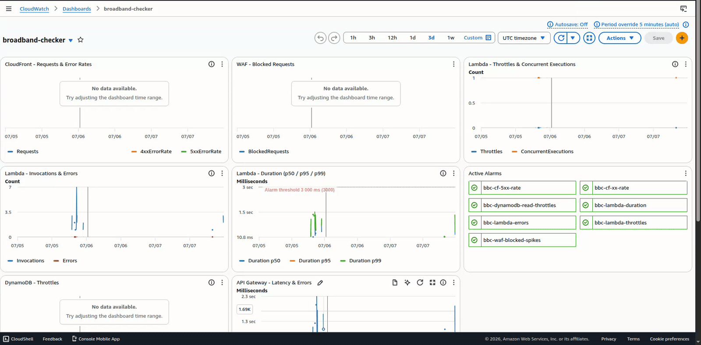

<h1 align="center">UK Broadband Checker — Serverless on AWS</h1>

<p align="center">
  <strong>UK postcode broadband checker</strong> — a static website and API on AWS,<br/>
  managed with Terraform and released through GitHub Actions.<br/>
  <em>Enter a postcode, see the available speeds, and find it on the map.</em>
</p>

---

## Architecture

<p align="center">
  
</p>

The application resources are in London (`eu-west-2`). CloudFront is global; its WAF web ACL and ACM certificate are managed through `us-east-1`. Terraform creates the website, API, cache, security controls and monitoring.

---

## Why this project

The project runs a small web app safely in the cloud:

* Terraform describes the AWS infrastructure
* GitHub Actions deploys it without storing AWS access keys using OIDC
* CloudFront and WAF protect the public site
* Two caches reduce repeated requests to Ofcom
* Terraform Apply and backend deployments check the health endpoint before they finish

> Based on [Ofcom’s public coverage checker](https://checker.ofcom.org.uk/en-gb/broadband-coverage).

<p align="center">
  <a href="docs/assets/webapp-hq.gif">
    
  </a>
  <br/>
  <em>High-resolution lookup preview — click to view at full size.</em>
</p>

[Download the full lookup recording (MP4)](docs/assets/webapp.mp4?raw=true) · [Original WebM](docs/assets/webapp.webm?raw=true)

---

## How a lookup works

1. A user types a postcode. The browser checks it against [postcodes.io](https://postcodes.io) and drops a pin on the map.
2. The app calls `/api/check?pc=…` behind CloudFront.
3. **Edge cache (up to 5 minutes)** — a successful response can be reused for the same `pc` query value, without invoking Lambda. Different casing or spacing can create different edge-cache entries.
4. **Database cache (24 hours)** — on an edge miss, Lambda normalises the postcode and returns an unexpired DynamoDB entry.
5. **Live fetch** — on a database miss or expired entry, Lambda calls Ofcom, starts a DynamoDB write for the next lookup, and returns the result. Failed cache writes are logged.

The API response includes `source: "cache"` for a DynamoDB hit or `source: "live"` for an Ofcom fetch. CloudFront can replay that response, so `source` does not identify an edge-cache hit.

---

## Infrastructure highlights

### Edge security

* HTTPS through a custom domain and ACM certificate
* Private S3 bucket, accessed through CloudFront only
* WAF rules to block common attacks and excessive requests
* Security headers such as HSTS, CSP and clickjacking protection

### Origin design

* A Node.js Lambda function handles postcode lookups
* DynamoDB keeps results for 24 hours
* The Ofcom key is kept in AWS (SSM) and is never sent to the browser
* Application lookup logs use an eight-character postcode hash instead of the raw postcode. This reduces exposure but is not a guarantee of anonymity.

### Delivery & caching

* Website files with content-hashed names are cached for one year
* `index.html` is uploaded with `no-cache, no-store`; the explicit `index.html` cache behaviour disables caching. The default `/` behaviour still uses `Managed-CachingOptimized`, so immediate freshness at the root URL is not guaranteed.
* Frontend and backend deploy separately through GitHub Actions

### Observability & cost

* One CloudWatch dashboard defines service metrics, alarms and Lambda cache/live log counts
* Email alerts cover errors, slow requests and throttling
* A **$20** monthly budget watches forecasted spend

---

## Scalability

The app can handle more visitors without adding or resizing servers.

* **CloudFront** serves the website and repeated lookups close to the visitor.
* **Lambda** runs only when a request reaches the API.
* **DynamoDB** grows with the number of cached postcodes.
* **API Gateway** and S3 are managed AWS services, so there is no server capacity to plan.

The two cache layers are:

* CloudFront can keep successful lookups for **up to 5 minutes**, keyed by the `pc` query value.
* DynamoDB keeps them for **24 hours**.

The caches reduce repeated Ofcom requests for popular postcodes. Concurrent misses can still trigger multiple live fetches, and expired entries or failed cache writes cause further requests.

If the project grew further, the next steps would be a second AWS region for failover, a higher WAF limit for shared networks, and scheduled caching for the busiest postcodes. The current design targets a UK-focused application; request charges and upstream API limits still need monitoring as traffic grows.

---

## CI/CD — six workflows without AWS access keys

GitHub Actions uses short-lived AWS permissions through OIDC. AWS access keys are not stored in the repository.

|Workflow|When it runs|What it does|
|-|-|-|
|`ci.yml`|Pushes to `main` and pull requests|Checks the code, runs tests, builds the demo, and runs Snyk, Checkov and Terraform formatting checks|
|`terraform-plan.yml`|Pull requests changing Terraform|Creates a read-only Terraform plan for review|
|`terraform-apply.yml`|Manual dispatch with `apply-prod`|Applies the infrastructure and checks `/api/health`|
|`deploy-frontend.yml`|Frontend changes on `main`|Builds and uploads the website|
|`deploy-backend.yml`|Lambda changes on `main`|Updates the API and checks its health|
|`terraform-destroy.yml`|Manual dispatch with `destroy-prod`|Removes the running AWS resources while keeping Terraform state|

GitHub Environments: **`production`** (apply and deploys) and **`production-destroy`** (teardown only). Required reviewers must be configured in GitHub to enforce approval; naming an environment in YAML alone does not require it. Snyk scans also need `SNYK_TOKEN`, and Checkov runs with the exclusions listed in `ci.yml`.

### Pipeline Documentation

<p align="center"><strong>CI, frontend deployment and Lambda deployment passing on <code>main</code></strong></p>
<p align="center">
  
</p>

<p align="center"><strong>Terraform Destroy — typed confirmation plus environment approval</strong></p>
<p align="center">
  
</p>

### Releases

Built JavaScript and CSS assets have hashed filenames and are uploaded with a one-year immutable cache header. The deployment also applies that header to other non-index files. `index.html` gets `no-cache, no-store`, but the default CloudFront cache policy has a minimum TTL: verify both `/` and `/index.html` when checking a release.

### Deployment safeguards

* Terraform Apply and Destroy need typed confirmation (`apply-prod` or `destroy-prod`); frontend and backend deploys run on matching pushes to `main`
* GitHub Environment approval can gate production jobs when required reviewers are configured
* Frontend and backend deployment workflows first check that their S3 bucket or Lambda function exists
* Terraform state and its lock table are protected from deletion

---

## Security Measures

|Protection|How it works|
|-|-|
|Private website|S3 is not public; CloudFront is the only way to read the site|
|Protected API|Requests must come through CloudFront and include a private verification value|
|Deployment permissions|GitHub uses temporary permissions through OIDC, not stored AWS keys|
|Secret handling|The Ofcom key stays in AWS and is read only by Lambda|
|Log privacy|Application lookup logs use a short postcode hash; hashes should still be treated as potentially identifying|
|Browser security|HTTPS, WAF and security headers protect visitors and the site|

---

## Observability

Terraform defines CloudWatch dashboard **`broadband-checker`**, combining London service metrics with CloudFront and WAF metrics from `us-east-1`. SNS email subscriptions must be confirmed before notifications arrive. A **$20** monthly AWS Budget monitors forecasted costs tagged `Project=broadband-checker`; activate the cost allocation tag for that filter.

|Area|What it shows|
|-|-|
|Website and WAF|Traffic, errors and blocked requests|
|API and Lambda|Requests, failures, speed and throttling|
|Database cache|Read/write throttle metrics and cache/live counts from Lambda logs|
|Alarms|Current status and recovery notifications|

The cache chart counts `source=cache` and `source=live` in Lambda logs, so it covers DynamoDB hits and Ofcom fetches, not CloudFront cache hits.

Before relying on the alerts, correct the existing metric configuration: CloudFront metrics need the `Region=Global` dimension (see [AWS metric requirements](https://docs.aws.amazon.com/AmazonCloudFront/latest/DeveloperGuide/programming-cloudwatch-metrics.html)); the 4xx alarm uses `Aws/CloudFront` instead of `AWS/CloudFront` and divides an error-rate percentage by request count; the DynamoDB read-throttle alarm targets `broadband-checker` instead of the actual `broadband-cache` table. Handled lookup failures return HTTP 502 and do not necessarily increment Lambda’s `Errors` metric.

<p align="center">
  <a href="docs/assets/cloudwatch-dashboard.gif">
    
  </a>
  <br/>
  <em>High-resolution dashboard walkthrough — click to view at full size.</em>
</p>

[Download the full dashboard recording (MP4)](docs/assets/cloudwatch-dashboard.mp4?raw=true) · [Original WebM](docs/assets/cloudwatch-dashboard.webm?raw=true)

---

## Run locally (no AWS required)

Demo mode uses a local fixture file for coverage data and needs no AWS account or Ofcom key. It still needs internet access for postcodes.io validation/autocomplete and external map tiles; it is not a fully offline mode.

**Requirements:** Node.js 20 or newer and npm 10 or newer.

```bash
git clone https://github.com/sudd22/broadband-checker.git
cd broadband-checker/frontend
npm ci
cp .env.example .env
npm run dev          # http://localhost:5173 (unless that port is occupied)
```

On Windows PowerShell, use `Copy-Item .env.example .env` instead of `cp .env.example .env`. Copy the example on first setup; if `.env` already exists, set `VITE_API_URL=/demo` in that file. Use `npm.cmd` if PowerShell blocks the `npm.ps1` launcher.

|Postcode|Scenario|What you should see|
|-|-|-|
|`SW1A 1AA`|Gigabit FTTP, London|1000 / 220 Mbps, full availability|
|`EH1 1YZ`|Superfast FTTC, Edinburgh|80 / 20 Mbps|
|`LL57 4TH`|Legacy copper, rural Wales|11 / 1 Mbps|
|`PO30 1UD`|No coverage, Isle of Wight|“No infrastructure available” alert (the fixture has 0 / 0 Mbps)|
|`BT71 7BA`|Simulated upstream failure|The error banner|
|Any other valid postcode|Generic fallback|67 / 18 Mbps FTTC|

Input is normalised first, so `sw1a 1aa`, `Sw1a1Aa` and `SW1A 1AA` all resolve to the same entry. `VITE_API_URL` selects the coverage source: `/demo` for fixtures, `/api` for the deployed same-origin backend. It has no code-level default, so creating `.env` is required. Restart Vite after changing it. Setting `/api` locally does not create or proxy a backend; the Vite configuration defines no API proxy. Leave `VITE_ORIGIN_VERIFY_SECRET` empty: `VITE_` values are bundled into browser code, and the deployed origin verification secret belongs in CloudFront and Lambda only.

From the frontend directory, stop the dev server with Ctrl+C and run the frontend checks:

```bash
npm test
npm run build
```

Backend tests mock AWS services and Ofcom fetches, so the tests need no AWS credentials or external network calls. Installing dependencies still needs access to npm:

```bash
cd ../lambda
npm ci
npm test             # 100% coverage gate on the handler
```

---

## Repository layout

```text
├── .github/workflows/          # CI, deploys, Terraform plan/apply/destroy
├── cloudfront-functions/       # CSP + security headers (viewer response)
├── frontend/                   # React + Vite + TS + Tailwind + MapLibre
│   └── public/data/            # Demo-mode fixture database
├── lambda/                     # Node 20 handler + Vitest (100% coverage)
├── terraform/                  # Root stack — wires origin, edge and observability
│   ├── bootstrap/              # State bucket, lock table, OIDC provider, IAM roles
│   ├── origin/                 # eu-west-2 compute, storage and secrets
│   ├── edge/                   # us-east-1 CDN, WAF, DNS, TLS
│   └── observability/          # Alarms, dashboard, SNS, budget
└── docs/assets/                # Recordings and screenshots
```

---

## Deploy model

### First time — set up AWS once

AWS deployment requires Terraform 1.7+, authenticated AWS credentials, an Ofcom API key, and an existing public Route 53 hosted zone for your registered domain. Delegate the domain to that zone before certificate validation. The stack looks up the zone; it does not create or destroy it.

The bootstrap configuration hard-codes a state bucket name containing the original account ID. Before deploying to another account, choose a globally unique bucket name in `terraform/bootstrap/state.tf` and update the matching backend in `terraform/main.tf`.

Create Terraform state and the GitHub connection locally once (these commands create billable resources):

```bash
# 1) Create Terraform state and GitHub permissions
cd terraform/bootstrap
terraform init
terraform apply

# 2) Create the application
cd ..
terraform init
# Set TF_VAR_ofcom_api_key securely in your shell before running this.
terraform apply -var="domain_name=<YOUR_DOMAIN>" -var="alert_email=<YOUR_EMAIL>"
```

Add the repository secrets used by the workflows:

|Secret|Value|
|-|-|
|`AWS_PLAN_ROLE_ARN`|Bootstrap `plan_role_arn` output|
|`AWS_DEPLOY_ROLE_ARN`|Bootstrap `deploy_role_arn` output|
|`CLOUDFRONT_DOMAIN`|Custom domain, without `https://`|
|`ALERT_EMAIL`|Address for SNS and budget notifications|
|`OFCOM_API_KEY`|Ofcom subscription key|
|`S3_BUCKET`|Application static bucket name|
|`SNYK_TOKEN`|Token for CI dependency scans|

Create the `production` and `production-destroy` GitHub Environments, configure required reviewers as appropriate, and confirm both SNS email subscriptions. Bootstrap currently grants the deploy role `AdministratorAccess`; this is broad permission, not a least-privilege policy. Keep the local bootstrap state safe: it tracks the retained resources. The Terraform plan role uses `ReadOnlyAccess`, so the plan workflow disables state locking.

### After setup, use Actions for deployments

```text
PR changing Terraform  →  plan for review  →  merge  →  manual Apply
Frontend change        →  build and upload the website
Lambda change          →  update the API and run a health check
```

---

## Cost

At low traffic, WAF is the main fixed application cost. With one web ACL and four configured rule entries, its base charge is approximately **$9/month**, plus request charges and any additional features. See [AWS WAF pricing](https://aws.amazon.com/waf/pricing/).

API Gateway, CloudFront, S3, DynamoDB, Lambda, CloudWatch, tracing, SSM and SNS add usage-dependent costs. Route 53 hosted-zone charges and domain renewal are separate; free-tier eligibility and domain pricing vary. A low-traffic total near $10/month is an estimate, not a guaranteed bill.

The **$20** tag-filtered budget sends forecast notifications at 20%, 40% and 80% ($4, $8 and $16). It alerts; it does not cap spending. After teardown, the retained hosted zone, Terraform state storage and lock-table usage can still incur charges, and the domain continues to renew.

---

## Teardown

**Actions → Terraform Destroy → Run workflow**, type `destroy-prod`, then approve the `production-destroy` environment.

|Destroyed|Retained by design|
|-|-|
|CloudFront, WAF, ACM, Route 53 records|Existing hosted zone and registered domain; Terraform **state bucket** (`prevent_destroy`)|
|S3 static + logs buckets|DynamoDB **state lock** table (`prevent_destroy`)|
|API Gateway, Lambda, DynamoDB cache, SSM parameter|GitHub OIDC provider + both IAM roles|
|CloudWatch alarms, dashboard, SNS topics, budget|Repository, recordings, demo mode|

Bootstrap resources stay in place. Recreate the infrastructure with Terraform Apply, then deploy the frontend and backend; the Apply workflow does not upload the website. The deployment workflows run on matching pushes to `main`. Demo coverage data does not depend on AWS.

---

## Live verification

```bash
curl -s https://seudd.online/api/health
# {"status":"ok","ts":"..."}
```

|Check|Expected|
|-|-|
|Custom domain over HTTPS|App loads through ACM + CloudFront|
|Postcode lookup|Results plus a map pin|
|Repeat lookup|Check the CloudFront `Age` / `X-Cache` headers and API `source`; latency alone is not proof of a cache hit|
|GitHub Actions|Check the relevant run for the commit being verified; saved screenshots are historical evidence|

---

## Design decisions

|Choice|Why it was made|
|-|-|
|Two cache layers|Faster repeat searches and fewer calls to Ofcom|
|Hashed postcode in lookup logs|Reduces raw postcode exposure; the hash still requires privacy care|
|Short-lived HTML, hashed assets|HTML gets no-cache headers while versioned assets get long caching; verify the root URL cache policy|
|Separate plan and deploy permissions|A pull request can review infrastructure without changing it|
|Demo mode|The website remains easy to test without AWS running|

---

## Author

**Seud** — Cloud & DevOps Engineer<br/>
GitHub: [@sudd22](https://github.com/sudd22) · Repository: [sudd22/broadband-checker](https://github.com/sudd22/broadband-checker)

Broadband data comes from Ofcom’s public coverage API.

<p align="center">
  <sub>Terraform, OIDC, edge security, caching and automated deployments.</sub>
</p>

